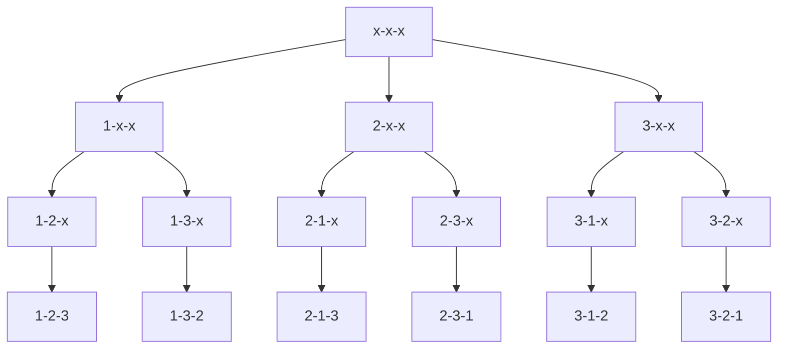

## 编程题

### [题目详情 - 实例1.1 最大子列和问题 (pintia.cn)](https://pintia.cn/problem-sets/434/problems/5404)

给定K个整数组成的序列 ${ N_1, N_2, ..., N_K }$，“连续子列”被定义为 ${ N_i, N_{i+1}, ..., N_j }$，其中 $1≤i≤j≤K$。“最大子列和”则被定义为所有连续子列元素的和中最大者。例如给定序列 ${ -2, 11, -4, 13, -5, -2 }$，其连续子列 ${ 11, -4, 13 }$有最大的和 $20$。现要求你编写程序，计算给定整数序列的最大子列和。

本题旨在测试各种不同的算法在各种数据情况下的表现。各组测试数据特点如下：

- 数据1：与样例等价，测试基本正确性；
- 数据2：$10^2$个随机整数；
- 数据3：$10^3$个随机整数；
- 数据4：$10^4$个随机整数；
- 数据5：$10^5$个随机整数；

### 输入格式:

输入第 $1$ 行给出正整数 $K (≤100000)$；第 $2$ 行给出 $K$ 个整数，其间以空格分隔。

### 输出格式:

在一行中输出最大子列和。如果序列中所有整数皆为负数，则输出 $0$。

### 输入样例:

```in
6
-2 11 -4 13 -5 -2
```

### 输出样例:

```out
20
```

### 思路

动态规划

归并

### 代码

#### 动态规划

```cpp
#include <iostream>

using namespace std;

const int N = 10;

int n;
int q[N];

int Max(void){
    int tmp = 0, sum = 0;
    for(int i = 1; i <= n; i++){
        tmp += q[i];
        if(tmp > sum) sum = tmp;
        else if(tmp < 0) tmp = 0;
    }
    return sum;
}

int main(void){

    cin >> n;

    int time = 0;
    for(int i = 1; i <= n; i++) scanf("%d", &q[i]), time += q[i];

    if(time <= -n) puts("0");
    else printf("%d", Max());  

    return 0;
}
```

#### 分治

```cpp
#include <iostream>

using namespace std;

const int N = 1e5 + 10;

int n;
int q[N];

int max3(int a, int b, int c){
    int tmp = a > b ? a : b;
    return tmp > c ? tmp : c;
}

int merge(int l, int r){
    if(l >= r){
        if(q[l] > 0) return q[l];
        else return 0;
    }
    int mid = l + r >> 1;

    int max_left_sum = merge(l, mid);
    int max_right_sum = merge(mid + 1, r);

    int left_sum = 0, left_tmp = 0;
    for(int i = mid; i >= l; i--){// 判断左侧最大子序列
        left_tmp += q[i];
        left_sum = max(left_sum, left_tmp);
    }

    int right_sum = 0, right_tmp = 0;
    for(int i = mid + 1; i <= r; i++){// 判断右侧最大子序列
        right_tmp += q[i];
        right_sum = max(right_sum, right_tmp);
    }

    // 因为需要判断处于中间的最大子序列，
    // 故左侧从分界点向左侧循环， 右侧从分界点向右侧循环

    return max3(max_left_sum, max_right_sum, left_sum + right_sum);
}

int main(void){

    cin >> n;

    int tmp = 0;
    for(int i = 0; i < n; i++){
        scanf("%d", &q[i]);
        if(q[i] < 0) tmp++;
    }

    if(tmp == n) puts("0");
    else printf("%d\n", merge(0, n - 1));

    return 0;
}
```

### [题目详情 - 习题2.1 简单计算器 (pintia.cn)](https://pintia.cn/problem-sets/434/problems/5405)

模拟简单运算器的工作。假设计算器只能进行加减乘除运算，运算数和结果都是整数，四种运算符的优先级相同，按从左到右的顺序计算。

### 输入格式:

输入在一行中给出一个四则运算算式，没有空格，且至少有一个操作数。遇等号”=”说明输入结束。

### 输出格式:

在一行中输出算式的运算结果，或者如果除法分母为0或有非法运算符，则输出错误信息“ERROR”。

### 输入样例:

```in
1+2*10-10/2=
```

### 输出样例:

```out
10
```

### 思路

简单模拟题

### 代码

```cpp
#include <iostream>

using namespace std;

int n;
char op;
int sum;

int main(void){
    
    cin >> sum >> op;
    
    while(op != '='){
        cin >> n;
        
        if(op == '+') sum += n;
        else if(op == '-') sum -= n;
        else if(op == '*') sum *= n;
        else if(op == '/'){
             if(n == 0){
                puts("ERROR");
                return 0;
             }
            else sum /= n;
        }
        else{
            puts("ERROR");
            return 0;
        }
        
        cin >> op;
    }
    cout << sum << endl;
    
    return 0;
}
```

### [题目详情 - 习题2.2 数组循环左移 (pintia.cn)](https://pintia.cn/problem-sets/434/problems/5653)

本题要求实现一个对数组进行循环左移的简单函数：一个数组$a$中存有 $n$（$>0$）个整数，在不允许使用另外数组的前提下，将每个整数循环向左移$m$（$≥0$）个位置，即将 $a$ 中的数据由（$a_0a_1⋯a_{n−1}$）变换为（$a_m⋯a_{n−1}a_0a_1⋯a_{m−1}$）（最前面的 $m$ 个数循环移至最后面的 $m$ 个位置）。如果还需要考虑程序移动数据的次数尽量少，要如何设计移动的方法？

### 输入格式:

输入第 $1$ 行给出正整数 $n$（$≤100$）和整数$m$（$≥0$）；第 $2$ 行给出 $n$ 个整数，其间以空格分隔。

### 输出格式:

在一行中输出循环左移 $m$ 位以后的整数序列，之间用空格分隔，序列结尾不能有多余空格。

### 输入样例：

```in
8 3
1 2 3 4 5 6 7 8
```

### 输出样例：

```out
4 5 6 7 8 1 2 3
```

### 思路

模拟题，没意思

### 代码

```cpp
#include <iostream>

using namespace std;

const int N = 1e2 + 10;

int n, m;
int q[N];

void s(){
    for(int i = n - 1; i >= 1; i--) swap(q[0], q[i]);
}

int main(void){

    cin >> n >> m;

    for(int i = 0; i < n; i++) cin >> q[i];

    m %= n;

    for(int i = 0; i < m; i++) s();

    cout << q[0];
    for(int i = 1; i < n; i++) cout << ' ' << q[i];
    cout << endl;

    return 0;
} 
```

### [题目详情 - 习题2.3 数列求和-加强版 (pintia.cn)](https://pintia.cn/problem-sets/434/problems/5654)

给定某数字 $A（1≤A≤9）$ 以及非负整数 $N（0≤N≤100000）$，求数列之和 $S=A+AA+AAA+⋯+AA⋯A（N个A）$。例如 $A=1, N=3$ 时，$S=1+11+111=123$。

### 输入格式：

输入数字 $A$ 与非负整数 $N$。

### 输出格式：

输出其 $N$ 项数列之和 $S$ 的值。

### 输入样例：

```in
1 3
```

### 输出样例：

```out
123
```

### 思路

高精度模板，且在对每位数值计算时，引入乘法。

### 代码

```cpp
#include <iostream>
#include <vector>

using namespace std;

int a, n;
vector<int> C;

void add(int a, int n){
    int t = 0;
    for(int i = 0; i < n; i++){
        t += a * (n - i);
        C.push_back(t % 10);
        t /= 10;
    }
    if(t) C.push_back(t);
}

int main(void){

    cin >> a >> n;

    if(n == 0){
        puts("0");
        return 0;
    }
    else add(a, n);

    for(int i = C.size() - 1; i >= 0; i--) printf("%d", C[i]);

    return 0;
}
```

### [题目详情 - 习题2.8 输出全排列 (pintia.cn)](https://pintia.cn/problem-sets/434/problems/5811)

请编写程序输出前 $n$ 个正整数的全排列$（n<10）$，并通过 $9$ 个测试用例（即 $n$ 从 $1$ 到 $9$ ）观察 $n$ 逐步增大时程序的运行时间。

### 输入格式:

输入给出正整数 $n（<10）$。

### 输出格式:

输出 $1$ 到 $n$ 的全排列。每种排列占一行，数字间无空格。排列的输出顺序为字典序，即序列 $a_1,a_2,⋯,a_n$ 排在序列 $b_1,b_2,⋯,b_n$ 之前，如果存在 $k$ 使得 $a_1=b_1,⋯,a_k=b_k$ 并且 $a_{k+1}<b_{k+1}$。

### 输入样例：

```in
3
```

### 输出样例：

```out
123
132
213
231
312
321
```

### 思路

核心：枚举顺序——依次枚举每个位置放哪个数

递归搜索树（以 $n = 3$ 为例）




### 代码

方法一：数组快

```cpp
#include <iostream>

using namespace std;

const int N = 10;

int n;
int q[N];// 用来存放当前位置放什么数
bool st[N];// 记录该数值是否被用过

void dfs(int u){
    if(u > n){
        for(int i = 1; i <= n; i++) printf("%d", q[i]);
        puts("");
        return ;
    }
    else{
        for(int i = 1; i <= n; i++){// 枚举当前位置可以填什么数
            if(st[i] == false){
                st[i] = true;
                q[u] = i;
                dfs(u + 1);
                st[i] = false;// 还原现场
            }
        }
    }
}

int main(void){

    scanf("%d", &n);

    dfs(1);

    return 0;
}
```

方法二：STL慢

```cpp
#include <iostream>
#include <vector>

using namespace std;

int n;

vector<int> path;

void dfs(int u, int state){
    if(u == n){
        for(auto x : path) cout << x;
        cout << endl;
        return ;
    }
    for(int i = 0; i < n; i++){
        if(!(state >> i & 1)){
            path.push_back(i + 1);
            dfs(u + 1, state | (1 << i));
            path.pop_back();
        }
    }
}

int main(void){

    cin >> n;

    dfs(0, 0);

    return 0;
}
```

